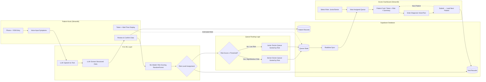

# AarogyaQueue

**"Because the sickest shouldn't wait the longest."**

Built in 24 hours for Central India Hackathon (CIH 3.0) | SDG 3: Good Health & Well-Being

---

## What Problem Are We Solving?

In rural India, government health centers often have just 1 or 2 doctors managing 100+ patients every day. Right now, these clinics use a simple first-come-first-serve system—whoever comes first, gets treated first.

**Why is this a problem?**

Imagine this: A patient with severe chest pain arrives at 10 AM. But there are already 40 people in line who came earlier, mostly with minor colds and fevers. That chest pain patient has to wait 3+ hours just because they came late.

**In healthcare, arrival time should not decide who gets treated first. Medical urgency should.**

But most clinics don't have the staff or tools to manually sort patients by urgency. That's where we come in.

---

## Our Idea 

AarogyaQueue is a simple queue management system that helps small clinics automatically prioritize patients based on how serious their symptoms are—not when they arrived.

Patients tell their symptoms (by voice or text), and our system gives them a risk score. High-risk patients go to the front of the line. Low-risk patients wait a bit longer. This way, critically ill people get faster care, and junior doctors can handle simple cases while senior doctors focus on serious ones.

**This is not a diagnosis tool.** We don't tell anyone what disease they have. We just help organize the waiting line better.

---

## How AarogyaQueue Works (Simple Flow)

Here's what happens when a patient visits a clinic using our system:

**Step 1: Patient Arrives**  
They enter their phone number and year of birth at a kiosk (tablet at the clinic entrance).

**Step 2: Describe Symptoms**  
The system asks: "What problem are you facing today?"  
The patient speaks or types their answer (e.g., "I have fever and cough for 3 days").

**Step 3: Computer Understands Symptoms**  
Our system uses AI to convert speech to text and extract important details like age, symptoms, and how long they've been sick.

**Step 4: Risk Score Is Calculated**  
A machine learning model (trained on medical data) gives the patient a risk score from 0 to 1.  
- **High risk (0.7–1.0)**: Serious symptoms like chest pain, breathing difficulty  
- **Medium risk (0.4–0.7)**: Persistent fever, severe headache  
- **Low risk (0–0.4)**: Mild cold, minor injuries

**Step 5: Patient Gets Token & Wait Time**  
The patient receives a token number and estimated wait time. They can see where they are in the queue.

**Step 6: Doctor Sees the Queue**  
Doctors log into their dashboard and select their role (Junior Doctor or Senior Doctor).  
- Senior doctors see high and medium-risk patients.  
- Junior doctors see low-risk patients.

**Step 7: Doctor Reviews Patient Summary**  
The doctor sees the patient's symptoms, risk score, and why they were flagged as urgent.

**Step 8: Consultation Happens**  
Doctor examines the patient, enters diagnosis, and clicks "Next Patient."

---

## What We Built
### Patient Side
- Phone number and year of birth entry for quick registration
- Text input for symptoms (voice input is simulated—we didn't have time to fully integrate speech recognition)
- AI extracts structured data from free-text symptoms
- Displays token number, risk level, and queue position
- Shows estimated wait time

### Doctor Side 
- Doctor selects role: Junior or Senior
- Sees only relevant patients (based on risk score)
- Views patient cards with:
  - Token number
  - Risk badge (High/Medium/Low)
  - AI-generated symptom summary
- Enters diagnosis and submits
- Next patient automatically loads

### Behind the Scenes
- Custom machine learning model (Random Forest) calculates risk scores based on symptoms
- Database (Supabase) stores patient records and keeps queues updated in real-time
- Risk-based routing: Patients automatically go to the right queue

---

## System Architecture

---

## Why This Is Useful in the Real World

### For Clinics
- No extra staff needed to manually triage patients
- Works on a single tablet—minimal setup cost
- Reduces chaos and arguments in the waiting area (everyone sees why someone was prioritized)

### For Doctors
- Senior doctors spend time on serious cases, not routine checkups
- Junior doctors gain experience with low-risk cases without risking patient safety
- Patient summaries save 2–3 minutes per consultation (no need to re-ask all symptoms)

### For Patients
- Critical patients get faster care—potentially life-saving
- Transparent system shows your position and why you're waiting
- No need to download an app or create accounts—works immediately

**Real-world estimate:**  
In a clinic with 100 patients/day, this system could reduce average wait time for high-risk cases by 30–40 minutes and help doctors see 10–15% more patients in the same time.

---

## SDG Alignment & Social Impact

This project directly addresses **SDG 3: Good Health & Well-Being**, specifically:

- **Target 3.8 (Universal Health Coverage):** Makes existing rural clinics more efficient without requiring more doctors
- **Target 3.c (Health Workforce Optimization):** Helps available doctors serve more people safely

### Measurable Impact

If deployed in just 100 Primary Health Centers across rural India:
- **15,000+ patients prioritized daily** based on medical need, not arrival time
- **Potentially life-saving** for emergency cases that would otherwise wait hours
- **Reduced doctor burnout** by distributing workload intelligently

This is about **fairness in healthcare**—making sure limited resources go to those who need them most urgently.

---

### Hackathon Constraints We Acknowledge
- The ML model is trained on publicly available medical data, not real Indian PHC data (we didn't have access in 24 hours).
- We haven't tested this with real doctors or patients yet (that would be the next step).
- The system assumes one clinic—multi-clinic networks would need more work.

**This is an MVP (Minimum Viable Product), not a finished product ready for hospitals.**

---

## Future Improvements

If we continue working on this after the hackathon, here are the next steps:

1. **WhatsApp Integration:**  
   Patients could send a voice message to a WhatsApp number before reaching the clinic, reducing kiosk crowding.

2. **Real Voice Input in Local Languages:**  
   Add support for Hindi, Marathi, and other regional languages using Google Speech-to-Text or similar.

3. **Analytics Dashboard for Health Officials:**  
   Track disease patterns, peak hours, and clinic efficiency to help government allocate resources better (e.g., "Send an extra doctor to this PHC on Tuesdays").

---
**Thanks to:**
- CIH 3.0 organizers for the opportunity and problem statement

